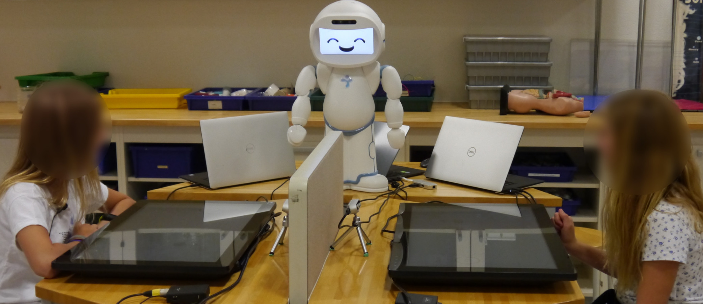
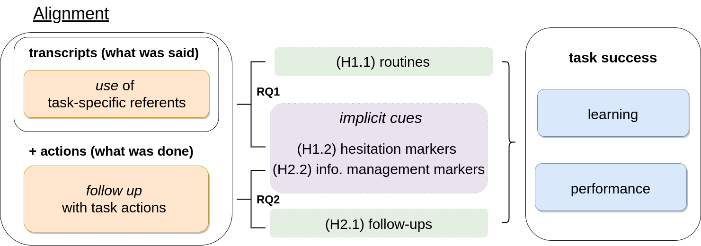

# JUSThink Alignment Analysis

[](https://zenodo.org/badge/latestdoi/333954991)
[](https://opensource.org/licenses/MIT)

This repository contains tools to automatically analyse how participants' align their use of task-specific referents in their dialogue and actions for a collaborative learning activity, and how it relates to the task success (i.e. their task performance and learning outcomes).

Specifically, it processes data from a collaborative problem solving activity named JUSThink, i.e. JUSThink Dialogue and Actions Corpus data that is available from the Zenodo Repository, DOI: [10.5281/zenodo.4627104](http://doi.org/10.5281/zenodo.4627104), and reproduces the results and figures in [[1]](#references).

In brief: 

1. JUSThink Dialogue and Actions Corpus contains dialogue transcripts, event logs, and test responses of children aged 9 through 12, as they participate in the JUSThink activity in teams of two, to solve a problem on graphs together. 
2. Our work [[1]](#references) studies the participants' use of expressions that are related to the task at hand, their follow up actions of these expressions, and how it links to task success.
3. The JUSThink activity and its study is first described in [[2]](#references), and elaborated with findings concerning the link between children's learning, performance in the activity, and perception of self, the other and the robot in [[3]](#references). 

See the [project website](https://www.epfl.ch/labs/chili/index-html/research/animatas/justhink/) for more details. 

Here is a glimpse from the JUSThink activity:



The tools are tested with Python 3.8 (in Ubuntu 20.04 LTS) and Python 3.6 (in Ubuntu 18.04 LTS) and package versions at [requirements.txt](requirements.txt).

The [main analysis tools](#notebooks) are writen in [Python](https://www.python.org/), in [Jupyter Notebook](https://jupyter.org/) environment.


### Publications

If you use this work in an academic context, please cite the following publication(s):

* Norman*, U., Dinkar*, T., Bruno, B., & Clavel, C. (2022). Studying Alignment in a Collaborative Learning Activity via Automatic Methods: The Link Between What We Say and Do. Dialogue & Discourse, 13(2), 1–48. *Contributed equally to this work. https://doi.org/10.5210/dad.2022.201

        @article{norman_dinkar_studying_2022,
            title        = {Studying Alignment in a Collaborative Learning Activity via Automatic Methods: The Link Between What We Say and Do},
            author       = {Norman*, Utku and Dinkar*, Tanvi and Bruno, Barbara and Clavel, Chloé},
            journaltitle = {Dialogue \& Discourse},
            volume       = {13},
            number       = {2},
            pages        = {1--48},  
            month        = aug,
            year         = 2022,
            doi          = {10.5210/dad.2022.201},
            note         = {*Contributed equally to this work.},
        }
* Norman, U., Dinkar, T., Bruno, B., & Clavel, C. (2021). JUSThink Alignment Analysis. In Dialogue & Discourse (v1.0.0, Vol. 13, Number 2, pp. 1–48). Zenodo. https://doi.org/10.5281/zenodo.4675070

        @software{norman_dinkar_justhink_2021,
            title        = {{JUSThink} Alignment Analysis},
            author       = {Norman, Utku and Dinkar, Tanvi and Bruno, Barbara and Clavel, Chloé},
            month        = apr,
            year         = 2021,
            publisher    = {Zenodo},
            version      = {v1.0.0},
            doi          = {10.5281/zenodo.4675070},
            url          = {https://doi.org/10.5281/zenodo.4675070}
        }


## Table of Contents
1. [Installation](#installation)
2. [Content](#content)
    1. [Jupyter Notebooks](#notebooks) (in [tools/](tools/))
    2. [External Tools](#additional_tools) (in [tools/](tools/))
    3. [The Dataset](#dataset) (as a subproject, at [data/](data/))
    4. [The Processed Data](#processed_data) (generated at [processed_data/](processed_data/))
    5. [The Figures](#figures) (generated at [figures/](figures/))
3. [Research Questions and Hypotheses](#rqs_hs) in [[1]](#references)
4. [Acknowledgements](#acknowledgements)
5. [References](#references)


## 1. Installation <a name="installation"></a>
1. Run the following command to obtain these tools, including [the dataset](#dataset):
```
git clone https://github.com/chili-epfl/justhink-alignment-analysis.git
```

2) Create a new [virtual environment](https://docs.python.org/3/tutorial/venv.html) and activate it (can do so in the same folder. Note that the folder name `.venv` is [git-ignored](https://git-scm.com/docs/gitignore)):
```
cd justhink-alignment-analysis

python3 -m venv .venv --prompt JUSThink-alignment-env

source .venv/bin/activate
```

If you do not have the `venv` package, first install it by: `sudo apt install python3-venv`

3) Install the dependencies via `pip`:
```
pip install wheel
pip install -r requirements.txt
```

4) Install Java to be able to run the external tool [dialign](tools/dialign-1.0) (used only by [Notebook 4](tools/4_extract_routines_from_transcripts.ipynb)), if it does not exist (check on the command prompt by `java`):
```
sudo apt install default-jre
```

5) Create a jupyter kernel that uses this virtual environment.
```
python -m ipykernel install --user --name justhink-alignment-env --display-name "Python (JUSThink-alignment)"
```

Done!

(optional) Note that the dataset is an external subproject/module, added here as a git subtree. To obtain the latest version of [the dataset](#dataset), run:
```
git subtree pull --prefix=data/ git@github.com:chili-epfl/justhink-dialogue-and-actions-corpus.git master --squash
```

If you encounter the error `LaTeX Error: File type1cm.sty not found.` while generating PDF figures with LaTeX (e.g. in [Notebook 3]((tools/3_visualise_transcribed_teams.ipynb)), install the following packages:
```
sudo apt-get install dvipng texlive-latex-extra texlive-fonts-recommended cm-super
```

## 2. Content <a name="content"></a>

The tools provided in this repository consists of 7 Jupyter Notebooks written in Python 3, and two additional external tools utilised by the notebooks.

### 2.1. Jupyter Notebooks <a name="notebooks"></a>

We highlight that the notebooks up until the last (i.e. to [test the hypotheses](tools/7_test_the_hypotheses.ipynb)) present a general pipeline to process event logs, test responses and transcripts to extract measures of task performance, learning outcomes, and measures of alignment.

1. [Extract task performance (and other features) from the logs](tools/1_extract_performance_and_other_features_from_logs.ipynb):
Extracts various measures of task behaviour from the logs, at varying granularities of the activity (i.e. the whole corpus, task, attempt, and turn levels). 
In later notebooks, we focus on one of the features to estimate the task performance of a team: (minimum) error.
2. [Extract learning outcomes from the test responses](tools/2_extract_learning_gain_from_test_responses.ipynb):
Extracts measures of learning outcomes from the responses to the pre-test and the post-test.
In later notebooks, we focus on one of the features to estimate the learning outcomes of a team: relative learning gain [[4]](#references).
3. [Select and visualise a subset of teams for transcription](tools/3_visualise_transcribed_teams.ipynb):
Visualises the transcribed teams among the other teams in the feature space spanned by task performance and learning outcome, as well as the distribution of their number of attempts and turns.
4. [Extract routines from transcripts](tools/4_extract_routines_from_transcripts.ipynb) (uses [dialign](#dialign), as an external module, to extract routines): 
Extracts routines of referring expressions that are "fixed", i.e. become shared or established amongst interlocutors.
5. [Combine transcripts with logs](tools/5_construct_the_corpus_by_combining_transcripts_with_logs.ipynb):
Merges transcripts with event logs to have a combined dialogue and actions corpus, to be processed e.g. to detect follow-up actions.
6. [Recognise instructions and detect follow-up actions](tools/6_recognise_instructions_detect_follow-up_actions.ipynb): 
Extracts verbalised instruction such as "connect Mount Basel to Montreux", and pairs them with the follow-up action that may *match* (e.g. if the other connects Basel to Montreux) or *mismatch* (e.g. if the other connects Basel to Neuchatel) with the instruction.
7. [Test the hypotheses](tools/7_test_the_hypotheses.ipynb) in [[1]](#references) (uses [effsize](#effsize) to estimate effect size, specifically Cliff's Delta):
Considers each [research questions and hypotheses](#rqs_hs) studied in [[1]](#references) and generates the results in [[1]](#references).

Note that the later notebooks in numbering utilise processed data exported by the relevant subset of earlier notebooks.

### 2.2. External Tools <a name="additional_tools"></a>

1. [dialign](tools/dialign-1.0) <a name="dialign"></a> tool to extract routines, specifically [Release 1.0](https://github.com/GuillaumeDD/dialign/releases/tag/v1.0) from [dialign-1.0.zip](https://github.com/GuillaumeDD/dialign/releases/download/v1.0/dialign-1.0.zip):
It extracts routine expressions that are "shared" among the participants from transcripts. 
It is used as an external module (in accordance with its CeCILL-B License, see [License](#license)).
2. [effsize](tools/effsize) <a name="effsize"></a> tool to compute estimators of effect size.
We specifically use it to compute Cliff's Delta, which quantifies the amount difference between two groups of observations, by computing the Cliff's Delta statistic.
It is taken from project [DABEST](https://acclab.github.io/DABEST-python-docs/index.html) (see [License](#license)).


### 2.3. The Dataset (JUSThink Dialogue and Actions Corpus) <a name="dataset"></a>

The folder [data/](data/) contains the JUSThink Dialogue and Actions Corpus dataset, that is available from the Zenodo Repository, DOI: [10.5281/zenodo.4627104](http://doi.org/10.5281/zenodo.4627104). 

It is added to this project as a subproject (specifically, as a git subtree) from its corresponding GitHub repository at [https://github.com/chili-epfl/justhink-dialogue-and-actions-corpus](https://github.com/chili-epfl/justhink-dialogue-and-actions-corpus).


### 2.4. The Processed Data <a name="processed_data"></a>

The folder [processed_data/](processed_data/) contains the processed version of the [dataset](#dataset), the intermediate content that are used to obtain the results and [figures](#figures) in [[1]](#references).

### 2.5. The Figures <a name="figures"></a>

The folder [figures/](figures/) contains the figures that are presented in [[1]](#references), and produced by [Jupyter Notebooks](#notebooks).

## 3. Research Questions and Hypotheses <a name="rqs_hs"></a>
Here is the structure of our work [[1]](#references):



Specifically, we consider:

* RQ1: Lexical alignment: How do the interlocutors use expressions related to the task? Is this associated with task success?
    * H1.1: Task-specific referents become routine early for more successful teams.
    * H1.2: Hesitation phenomena are more likely to occur in the vicinity of priming and establishment of task-specific referents for more successful teams.

* RQ2: Behavioural alignment: How do the interlocutors follow up these expressions with actions? Is this associated with task success?
    * H2.1: Instructions are more likely to be followed by a corresponding action early in the dialogue for more successful teams.
    * H2.2: When instructions are followed by a corresponding or a different action, the action is more likely to be surrounded by information management phenomena for more successful teams.

The RQs and Hs are addressed in the notebook for [testing the hypotheses](tools/7_test_the_hypotheses.ipynb).


## Acknowledgements <a name="acknowledgements"></a>
This project has received funding from the European Union's Horizon 2020 research and innovation programme under grant agreement No 765955. Namely, the [ANIMATAS Project](https://www.animatas.eu/).


## License <a name="license"></a>

The whole package is under MIT License, see [LICENSE](LICENSE).

Classes under the [tools/effsize](tools/effsize) package were taken from project [DABEST](https://acclab.github.io/DABEST-python-docs/index.html), Copyright 2016-2020 Joses W. Ho. These classes are licensed under the BSD 3-Clause Clear License. See [tools/effsize/LICENSE](tools/effsize/LICENSE) for additional details.

Classes under the [tools/dialign-1.0](tools/dialign-1.0) package were taken from project [dialign](https://github.com/GuillaumeDD/dialign). These classes are licensed under the CeCILL-B License. This package is used as an "external module", see [tools/dialign-1.0/LICENSE.txt](tools/dialign-1.0/LICENSE.txt) for additional details.


## References <a name="references"></a>

[1] U. Norman\*, T. Dinkar\*, B. Bruno, and C. Clavel, "Studying Alignment in a Collaborative Learning Activity via Automatic Methods: The Link Between What We Say and Do," Dialogue & Discourse, 13(2), 1–48. *Contributed equally to this work. doi: [10.5210/dad.2022.201](https://doi.org/10.5210/dad.2022.201).

[2] J. Nasir, U. Norman, B. Bruno, and P. Dillenbourg, "You Tell, I Do, and We Swap until we Connect All the Gold Mines!," ERCIM News, vol. 2020, no. 120, 2020, [Online]. Available: [https://ercim-news.ercim.eu/en120/special/you-tell-i-do-and-we-swap-until-we-connect-all-the-gold-mines](https://ercim-news.ercim.eu/en120/special/you-tell-i-do-and-we-swap-until-we-connect-all-the-gold-mines).

[3] J. Nasir\*, U. Norman\*, B. Bruno, and P. Dillenbourg, "When Positive Perception of the Robot Has No Effect on Learning," in 2020 29th IEEE International Conference on Robot and Human Interactive Communication (RO-MAN), Aug. 2020, pp. 313–320. *Contributed equally to this work. doi: [10.1109/RO-MAN47096.2020.9223343](https://doi.org/10.1109/RO-MAN47096.2020.9223343).

[4] M. Sangin, G. Molinari, M.-A. Nüssli, and P. Dillenbourg, "Facilitating peer knowledge modeling: Effects of a knowledge awareness tool on collaborative learning outcomes and processes,"" Computers in Human Behavior, vol. 27, no. 3, pp. 1059–1067, May 2011, doi: [10.1016/j.chb.2010.05.032](https://doi.org/10.1016/j.chb.2010.05.032).
