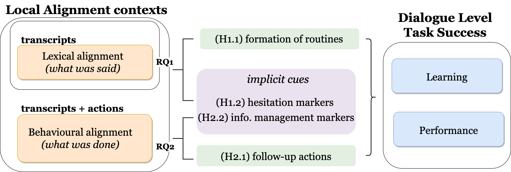

# JUSThink Alignment Analysis

This repository contains tools to automatically analyse how participants' align their use of task-specific referents in their dialogue and actions for a collaborative learning activity, and how it relates to the task success.

Specifically, it processes data from a collaborative problem solving activity named JUSThink, i.e. JUSThink Dialogue and Actions Corpus data that is available from the Zenodo (Sandbox) Repository, DOI: [10.5072/zenodo.741914](https://sandbox.zenodo.org/record/741914), and reproduces the results and figures in [[1]](#references).

In brief: 

1. JUSThink Dialogue and Actions Corpus contains event logs, test responses and transcripts of children aged 9 through 12, as they participate in the JUSThink activity in pairs of two, to solve a problem on graphs together. 
2. Our work [[1]](#references) studies the participants' use of expressions that are related to the task at hand, their follow up actions of these expressions, and how it links to task success.
3. The JUSThink activity and its study is first described in [[2]](#references), and elaborated with findings concerning the link between children's learning, performance in the activity, and perception of self, the other and the robot in [[3]](#references). 

See the [project website](https://www.epfl.ch/labs/chili/index-html/research/animatas/justhink/) for more details. 

Here is a glimpse from the JUSThink activity:


## Table of Contents
1. [Installation](#installation)
2. [Content](#content)
    1. [Jupyter Notebooks](#notebooks)
    2. [Additional External Tools](#additional_tools)
3. [Research Questions and Hypotheses](#rqs_hs)
4. [Acknowledgements](#acknowledgements)
5. [References](#references)


## 1. Installation <a name="installation"></a>
Run the following command to obtain the source code:
```
git clone --recurse-submodules git@github.com:utku-norman/justhink-alignment-analysis.git
```

The analysis code is writen in Python, in [Jupyter Notebook](https://jupyter.org/) environment. 

The Python dependencies differ among the notebooks, and can be installed via a package manager for Python e.g. [pip](https://pip.pypa.io/).


## 2. Content <a name="content"></a>

The tools provided in this repository consists of 7 Jupyter Notebooks written in Python 3, and two additional external tools utilised by the notebooks.

### 2.1. Jupyter Notebooks <a name="notebooks"></a>

We highlight that the notebooks up until the last (i.e. to [test the hypotheses](tools/7_test_the_hypotheses.ipynb)) present a general pipeline to process event logs, test responses and transcripts to extract measures of task performance, learning outcomes, and measures of alignment.

1. [Extract task performance (and other features) from the logs](tools/1_extract_performance_and_other_features_from_logs.ipynb):
Extracts various measures of task behaviour from the logs, at varying granularities of the activity (i.e. the whole corpus, task, attempt, and turn levels). 
In later notebooks, we focus on one of the features to estimate the task performance of a team: (minimum) error.
2. [Extract learning outcomes from the test responses](tools/2_extract_learning_gain_from_test_responses.ipynb):
Extracts measures of learning outcomes from the responses to the pre-test and the post-test.
In later notebooks, we focus on one of the features to estimate the learning outcome of a team: relative learning gain [[4]](#references).
3. [Select and visualise a subset of teams for transcription](tools/3_visualise_transcribed_teams.ipynb):
Visualises the transcribed teams among the other teams in the feature space spanned by task performance and learning outcome, as well as the distribution of their number of attempts and turns.
4. [Extract routines from transcripts](tools/4_extract_routines_from_transcripts.ipynb) (uses [dialign](https://github.com/GuillaumeDD/dialign) to extract routines): 
Extracts routines of referring expressions that are "fixed", i.e. become shared or established amongst interlocutors.
5. [Combine transcripts with logs](tools/5_construct_the_corpus_by_combining_transcripts_with_logs.ipynb):
Merges transcripts with event logs to have a combined dialogue and actions corpus, to be processed e.g. to detect follow-up actions.
6. [Recognise instructions and detect follow-up actions](tools/6_recognise_instructions_detect_follow-up_actions.ipynb): 
Extracts verbalised instruction such as "connect Mount Basel to Montreux", and pairs them with the follow-up action that may *match* (e.g. if the other connects Basel to Montreux) or *mismatch* (e.g. if the other connects Basel to Neuchatel) with the instruction.
7. [Test the hypotheses](tools/7_test_the_hypotheses.ipynb) in [[1]](#references) (uses [cliffsDelta](https://github.com/neilernst/cliffsDelta) to estimate effect size):
Considers each [research questions and hypotheses](#rqs_hs) studied in [[1]](#references) and generates the results in [[1]](#references).

Note that the later notebooks in numbering utilise processed data exported by the relevant subset of earlier notebooks.


### 2.2. Additional External Tools <a name="additional_tools"></a>

1. [dialign](https://github.com/GuillaumeDD/dialign) tool to extract routines, specifically [Release 1.0](https://github.com/GuillaumeDD/dialign/releases/tag/v1.0) from [dialign-1.0.zip](https://github.com/GuillaumeDD/dialign/releases/download/v1.0/dialign-1.0.zip):
It extracts routine expressions that are "shared" among the participants from transcripts.
2. [cliffsDelta](https://github.com/neilernst/cliffsDelta) tool to compute an estimator of effect size, Cliff's Delta: 
It quantifies the amount difference between two groups of observations, by computing the Cliff's Delta statistic.

## 3. Research Questions and Hypotheses <a name="rqs_hs"></a>
Here is the structure of our work [[1]](#references):



Specifically, we consider:

* RQ1 How do the interlocutors use task specific referents? Does this link to task success?
    * H1.1: Task specific referents become routine earlier for more successful teams.
    * H1.2: When (a) task specific referents become routine and (b) their routines are primed, they are more likely to be surrounded by hesitation phenomena for more successful teams.

* RQ2 How do the interlocutors follow up the use of task specific referents with actions? Does this link to task success?
    * H2.1: Instructions are more likely to be followed by the corresponding actions earlier in the dialogue for more successful teams.
    * H2.2: When instructions are followed by the corresponding actions (or another action), they are more likely to be surrounded by information management phenomena for more successful teams.

The RQs and Hs are addressed in the notebook for [testing the hypotheses](tools/7_test_the_hypotheses.ipynb).


## Acknowledgements <a name="acknowledgements"></a>
 This project has received funding from the European Union's Horizon 2020 research and innovation programme under grant agreement No 765955. Namely, the [ANIMATAS Project](https://www.animatas.eu/).


## References <a name="references"></a>

[1] U. Norman\*, T. Dinkar\*, B. Bruno, P. Dillenbourg, and C. Clavel, "How Do Children Use Task-specific Referents to Succeed in a Collaborative Learning Activity?: Studying Alignment in Spontaneous Speech via Automatic Methods," under review, 2021.

[2] J. Nasir, U. Norman, B. Bruno, and P. Dillenbourg, "You Tell, I Do, and We Swap until we Connect All the Gold Mines!," ERCIM News, vol. 2020, no. 120, 2020, [Online]. Available: [https://ercim-news.ercim.eu/en120/special/you-tell-i-do-and-we-swap-until-we-connect-all-the-gold-mines](https://ercim-news.ercim.eu/en120/special/you-tell-i-do-and-we-swap-until-we-connect-all-the-gold-mines).

[3] J. Nasir\*, U. Norman\*, B. Bruno, and P. Dillenbourg, "When Positive Perception of the Robot Has No Effect on Learning," in 2020 29th IEEE International Conference on Robot and Human Interactive Communication (RO-MAN), Aug. 2020, pp. 313–320, doi: [10.1109/RO-MAN47096.2020.9223343](https://doi.org/10.1109/RO-MAN47096.2020.9223343).

[4] M. Sangin, G. Molinari, M.-A. Nüssli, and P. Dillenbourg, "Facilitating peer knowledge modeling: Effects of a knowledge awareness tool on collaborative learning outcomes and processes,"" Computers in Human Behavior, vol. 27, no. 3, pp. 1059–1067, May 2011, doi: [10.1016/j.chb.2010.05.032](https://doi.org/10.1016/j.chb.2010.05.032).


